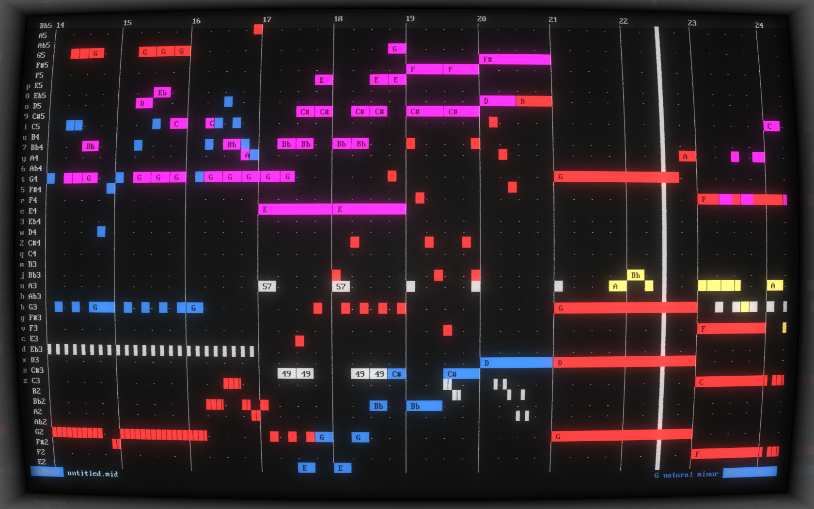

# MusiCLI

MusiCLI (pronounced "musically") is a MIDI sequencer that runs entirely in the terminal.

MusiCLI 1.0 was developed in C++ by Aaron Friesen and David Ryan for [CornHacks 2021](https://unlcornhacks.com).
It provided a tracker-like curses interface, MIDI export via [Midifile](https://midifile.sapp.org), and limited playback via [FluidSynth](https://fluidsynth.org).
For those interested in the old version, it can be found at the tag `v1.0.0`.

MusiCLI 2.0 is a complete rewrite of MusiCLI in Python, developed from scratch by Aaron Friesen for [CornHacks 2022](https://unlcornhacks.com), where it won third place overall!
MusiCLI 2.0 presents a piano roll interface, MIDI import and export via [mido](https://github.com/mido/mido), live non-blocking playback with [PyFluidSynth](https://github.com/nwhitehead/pyfluidsynth), and improved modal editing.



## Setup

- Python 3
- curses
- [mido](https://github.com/mido/mido)
- [FluidSynth](https://fluidsynth.org)
- [PyFluidSynth](https://github.com/nwhitehead/pyfluidsynth)

For directions on installing FluidSynth for your platform, refer to [Getting FluidSynth](https://www.fluidsynth.org/download/).

To install the required Python dependencies, run:
```sh
pip3 install -r requirements.txt
```

For live playback, you will need a soundfont in SF2 format.
I recommend the MuseScore General Soundfont, which can be freely downloaded from the [MuseScore handbook](https://musescore.org/en/handbook/3/soundfonts-and-sfz-files) along with other soundfonts.

## Usage

To run MusiCLI from the root directory of the repo, run:
```sh
./musicli.py file.mid -f soundfont.sf2
```

Providing a MIDI file to open is optional.
Providing an existing MIDI file will import it, while providing a nonexistent file will cause it to be created upon saving.
You may also provide no file; if you choose to save later, it will be saved as `untitled.mid`.

If you wish to import a MIDI file, but save changes to another file, use the `--import` or `-i` option:
```sh
./musicly.py file_to_export.mid -i file_to_import.mid -f soundfont.sf2
```

Providing a soundfont is also optional, but live playback will be unavailable unless you do.
If no soundfont is provided, MusiCLI will look for one at `/usr/share/soundfonts/default.sf2`, which is FluidSynth's default location.

Much more song-specific information can be customized via other command line arguments. View a full list by running:
```sh
./musicli.py -h
```

### Interface

Unlike the original tracker interface of MusiCLI 1.0, MusiCLI 2.0 provides a piano roll editor that should be familiar to users of modern DAWs.

Each line represents a different pitch, labeled with its note name on the left of the UI.
Further left is the key you can type to enter that note while in insert mode (more on that later).
The dots on some rows correspond to the notes in the current key and scale you are using.
By default, this is C Major, but you can change it with the `--key` and `--scale` arguments.

Each character column represents a subdivision of a beat (what MusiCLI internally refers to as a "unit").
By default, this is a 16th note, but this can be customized with the `--units-per-beat` argument.
Each beat is marked with a dot, and each measure is marked with a line.
The length of each measure can be customized with `--beats-per-measure` flag.

Each note is represented by a colored rectangle that occupies one pitch but may span multiple beats.
Longer notes are labeled with their note name for convenience.
The last note entered is highlighted in white, and the notes in the last chord entered are highlighted in gray (if available, otherwise white as well).
The color of the note represents which MIDI track it is on.
Notes may overlap, including notes from different tracks.
Currently, instruments cannot be changed while in the editor, but better support for instruments (including drums) is planned with a high priority.

The thin white vertical line is the cursor, which shows where you are currently editing notes.
The thicker white vertical line is the playhead, which is where playback is currently playing or stopped.

The editor scrolls infinitely horizontally, and a limited amount vertically, encompassing the full range of MIDI notes.

### Editing

MusiCLI is a modal editor, like vim, which means that there are different states in which keys do different actions.

The default mode is Normal mode, which allows you to navigate freely and use more special commands.

You can enter Insert mode by pressing `i`.
Insert mode allows you to insert notes into your song directly by typing them on the keyboard.
You may always return to normal mode by pressing Escape.

In insert mode, the keys are laid out like two rows of a piano, with the `z` and `a` rows forming the lower set of white and black keys respectively, and the `q` and number rows forming the higher octave set.
This is a feature available in DAWs that support keyboard input, such as [LMMS](https://lmms.io), and is intended to be at least marginally familiar to pianists.
For quick reference, the keys that correspond to each note are listed to the left of them on the left sidebar.

To change where you are editing, use the arrow keys.
Left and right will change the beat you are entering, and up and down will change the octave range.
In Normal mode, you can pan around without changing where you're editing by using the vi keys `hjkl`.
Pressing Shift along with the vi keys will cause you to pan a shorter distance.

Many operations will affect the last note or chord you inserted.
These notes are highlighted in white and gray respectively.

### Keybindings

#### All Modes

- Up/Down: Edit one octave above/below your current range.
- Left/Right: Edit one step forward or backward in time.
  The number of beats you will travel is equal to the duration of the last note inserted.
- `[`/`]`: Adjust the duration of the last note entered by one unit.
  Holding Shift will affect the last chord.
- `,`/`.`: Adjust the beat of the last note entered by one unit.
  Holding Shift will affect the last chord.
- Backspace/Delete: Delete the last note entered.
  Currently only works for the very last note, and none before it.
- Space: Play, pause, or resume music playback, if a soundfont was provided with `-f` or `--soundfont`.
- Enter: Restart from the beginning of the song.
- `Ctrl+C`: Exit MusiCLI.

#### Normal Mode

- `hjkl`: Pan the view. Holding Shift will cause you to pan in smaller steps.
- `w`: Export the song as a MIDI file.
  **If you opened an existing file (using the `file` parameter), it will be overwritten.**
  Files imported with the `--import` argument will be unaffected.
  If you did not import a file but did specify a path, it will be saved to that path.
  If you did not specify a path, the file will be saved as `untitled.mid`.
- `i`: Enter insert mode.
- `a`: Enter insert mode and advance one step.
- Escape: Deselect notes.

#### Insert Mode

- All letters and numbers: Insert a note of the corresponding pitch at the current cursor position.
  Refer to the labels on the left sidebar for this correspondence.
- Escape: Return to normal mode.

## Contributing

MusiCLI is a small project initially developed during a hackathon, so be warned that it is not fully polished and documented yet.
Nonetheless, if you are interested in submitting PRs, we will be happy to review them!

If you want to submit a PR, please follow these guidelines:

- Run some Python linters such as Pylint, flake8, and/or mypy to help ensure consistent code style and quality.
- If you create any new Python source files, copy the license notice from `musicli.py` into them.

If you want to contribute but aren't sure what to work on, you can find a list of tasks in `TODO.md`.

If anyone is interested in maintaining and extending MusiCLI 1.0, feel free to make a fork of this repo based off of the `v1.0.0` tag, although I do not intend to maintain it any further myself.
